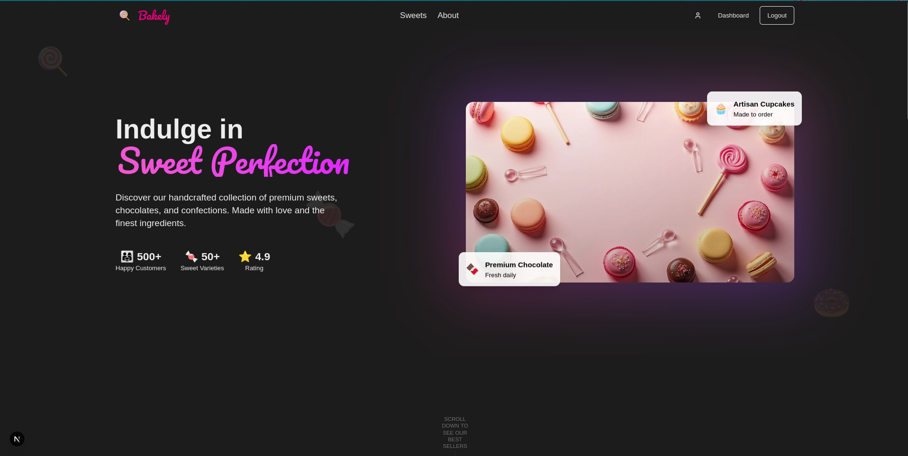
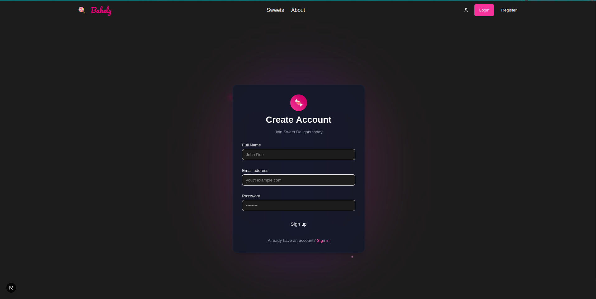
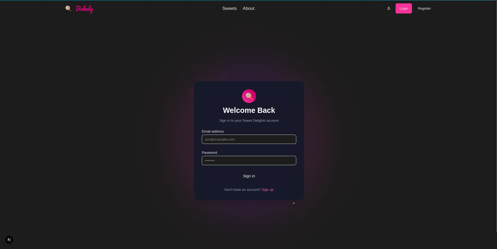
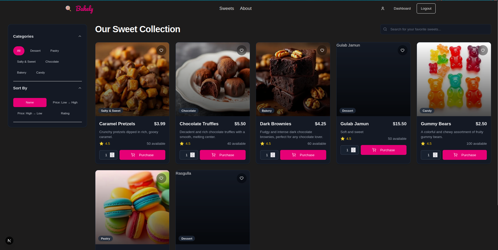
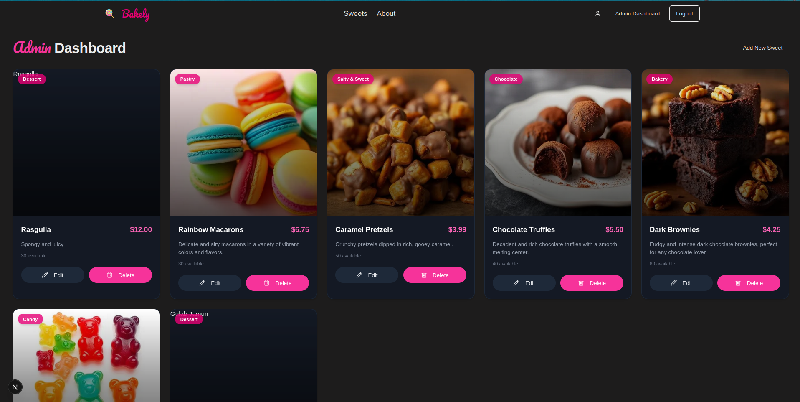

# Sweet Shop Management System (Bakely)

A full-stack application for managing a sweet shop, including inventory, sweet management, and user authentication.

### Homepage


### Tech Stack 

Next js Frontend + Backend App router

Drizzle ORM

PostgreSQL

Zod for from validations

Tailwind

Skipper UI for card animations

### AI Assistance 

ChatGpt 5 for Roadmap and Architecture for App

Claude for better Code error handling 

Gemini CLI for Bug fixes

Lovable to get Frontend design Motivation


### Test Report
"test-report.html" is the test report in the repo


## Live Website

https://bakely-qhnukwsvk-kaundalsaksham-gmailcoms-projects.vercel.app/

Admin login : s@gmail.com
customer login : j@gmail.com 

admin is only one and is created my the developer only 
normal login is default to customers

---
## Table of Contents
1. [Getting Started](#getting-started)
    - [Prerequisites](#prerequisites)
    - [Installation](#installation)
    - [Running the Application](#running-the-application)
2. [Available Scripts](#available-scripts)
3. [Project Structure](#project-structure)
4. [API Documentation](#api-documentation)
    - [Authentication APIs](#authentication-apis)
    - [Sweets APIs](#sweets-apis)
    - [Inventory APIs](#inventory-apis)
5. [Testing](#testing)
6. [User Interface Flow](#user-interface-flow)
7. [Live Website](#live-website)

---

## Getting Started

Follow these instructions to set up the project locally.

### Prerequisites

Make sure you have the following installed on your machine:
- [Node.js](httpss://nodejs.org/en/) (v18.x or later recommended)
- [npm](httpss://www.npmjs.com/) or [yarn](httpss://yarnpkg.com/)

### Installation

1.  **Clone the repository:**
    ```bash
    git clone <your-repository-url>
    cd sweet-shop-management
    ```

2.  **Install dependencies:**
    ```bash
    npm install
    ```

3.  **Set up environment variables:**
    Create a `.env.local` file in the root of the project and add the necessary environment variables. You can use the `.env.example` file as a reference if one is available.
    ```bash
    # .env.local
    DATABASE_URL="your_database_connection_string"
    # Add other environment variables here
    ```
4.  **Push DB schema
    ```bash
    npm run db:push
    ```

### Running the Application

Once the installation is complete, you can run the development server:

```bash
npm run dev
```

The application will be available at `http://localhost:3000`.

---

## Available Scripts

In the project directory, you can run the following commands:

-   `npm run dev`: Runs the app in development mode.
-   `npm run build`: Builds the app for production.
-   `npm run start`: Starts a production server.
-   `npm run lint`: Lints the project files.
-   `npm run test`: Runs the test suite.

---

## Project Structure

The project is a Next.js application with the following structure:

-   `src/app/`: Contains the main application pages and API routes.
-   `src/components/`: Contains reusable React components.
-   `src/lib/`: Contains utility functions and libraries.
-   `src/db/`: Contains database schema and migration scripts.
-   `public/`: Contains static assets.

---

## API Documentation

### Authentication APIs

#### 1. User Registration
- **Endpoint:** `POST /api/auth/register`
- **Description:** Registers a new user.
- **Request Body:**
  ```json
  {
    "name": "John Doe",
    "email": "john.doe@example.com",
    "password": "password123"
  }
  ```
- **Response:** Returns a success message on completion.

#### 2. User Login
- **Endpoint:** `POST /api/auth/login`
- **Description:** Authenticates a user and returns a session token.
- **Request Body:**
  ```json
  {
    "email": "john.doe@example.com",
    "password": "password123"
  }
  ```
- **Response:** Returns a success message and sets an authentication cookie.

### Sweets APIs

#### 1. Create Sweet
- **Endpoint:** `POST /api/sweets/create`
- **Description:** Adds a new sweet to the database.
- **Request Body:**
  ```json
  {
    "name": "Chocolate Truffle",
    "price": 2.50,
    "image": "chocolate-truffles.jpg"
  }
  ```
- **Response:** Returns the newly created sweet object.

#### 2. Get All Sweets
- **Endpoint:** `GET /api/sweets/getAll`
- **Description:** Retrieves a list of all available sweets.
- **Response:** An array of sweet objects.

#### 3. Update Sweet
- **Endpoint:** `PUT /api/sweets/update/[id]`
- **Description:** Updates the details of a specific sweet.
- **Request Body:**
  ```json
  {
    "name": "Deluxe Chocolate Truffle",
    "price": 3.00
  }
  ```
- **Response:** Returns the updated sweet object.

#### 4. Delete Sweet
- **Endpoint:** `DELETE /api/sweets/delete/[id]`
- **Description:** Removes a sweet from the database.
- **Response:** Returns a success message.

#### 5. Search Sweets
- **Endpoint:** `GET /api/sweets/search?query=<search_term>`
- **Description:** Searches for sweets by name.
- **Response:** An array of matching sweet objects.

### Inventory APIs

#### 1. Purchase Sweet
- **Endpoint:** `POST /api/inventory/[id]/purchase`
- **Description:** Records a purchase of a sweet, decreasing its stock.
- **Request Body:**
  ```json
  {
    "quantity": 10
  }
  ```
- **Response:** Returns a success message.

#### 2. Restock Sweet
- **Endpoint:** `POST /api/inventory/[id]/restock`
- **Description:** Records a restocking of a sweet, increasing its stock.
- **Request Body:**
  ```json
  {
    "quantity": 50
  }
  ```
- **Response:** Returns a success message.

---

## Testing

The application includes a comprehensive test suite to ensure code quality and correctness.

-   **Authentication:**
    -   `login.test.ts`: Tests the user login functionality.
    -   `register.test.ts`: Tests the user registration process.
-   **Sweets Management:**
    -   `create.test.ts`: Tests the creation of new sweets.
    -   `getAll.test.ts`: Tests fetching all sweets.
    -   `update.test.ts`: Tests updating sweet details.
    -   `delete.test.ts`: Tests deleting sweets.
    -   `search.test.ts`: Tests the search functionality.
-   **Inventory Management:**
    -   `purchase.test.ts`: Tests the purchase functionality.
    -   `restock.test.ts`: Tests the restock functionality.

---

## User Interface Flow

1.  **Homepage:**
    -   Displays a hero section with a call-to-action.
    -   Shows a grid of featured sweets.
    -   Users can navigate to the login, register, or sweets pages.

2.  **Authentication:**
    -   **Register Page (`/register`):** New users can create an account by providing their name, email, and password.
    -   **Login Page (`/login`):** Existing users can log in with their email and password.

3.  **Sweets Page (`/sweets`):**
    -   Displays all available sweets in a grid.
    -   Includes a filter and search bar to easily find specific sweets.
    -   Each sweet is displayed on a `SweetCard` with its name, price, and image.

4.  **Admin Dashboard (`/admin`):**
    -   Accessible only to authenticated admin users.
    -   Displays all sweets in an `AdminSweetsGrid`.
    -   Admins can:
        -   **Add new sweets** using the `AddSweetForm`.
        -   **Edit existing sweets** using the `EditSweetForm`.
        -   **Delete sweets**.
        -   **Manage inventory** by purchasing or restocking items directly from the `AdminSweetCard`.

---
Some Screen Shots from my WebSite

### Homepage


### Sign in


### log in


### log in


### dashboard


### admin dashboard


 

